# 今年見た Perlコミュニティと これから

### Yusuke Wada a.k.a. yusukebe

#### 2013-12-28
#### Hokkaido.pm#11

___

## 自己紹介

- 和田裕介 / 1981年12月23日生まれ
- 横浜 / 鎌倉 / 熱海
- (株) ワディット代表取締役
- (株) オモロキ取締役兼最高技術責任者
- 一般社団法人 Japan Perl Association 理事
- Webアプリケーションデベロッパー

___

## 飛行機で来ました^^

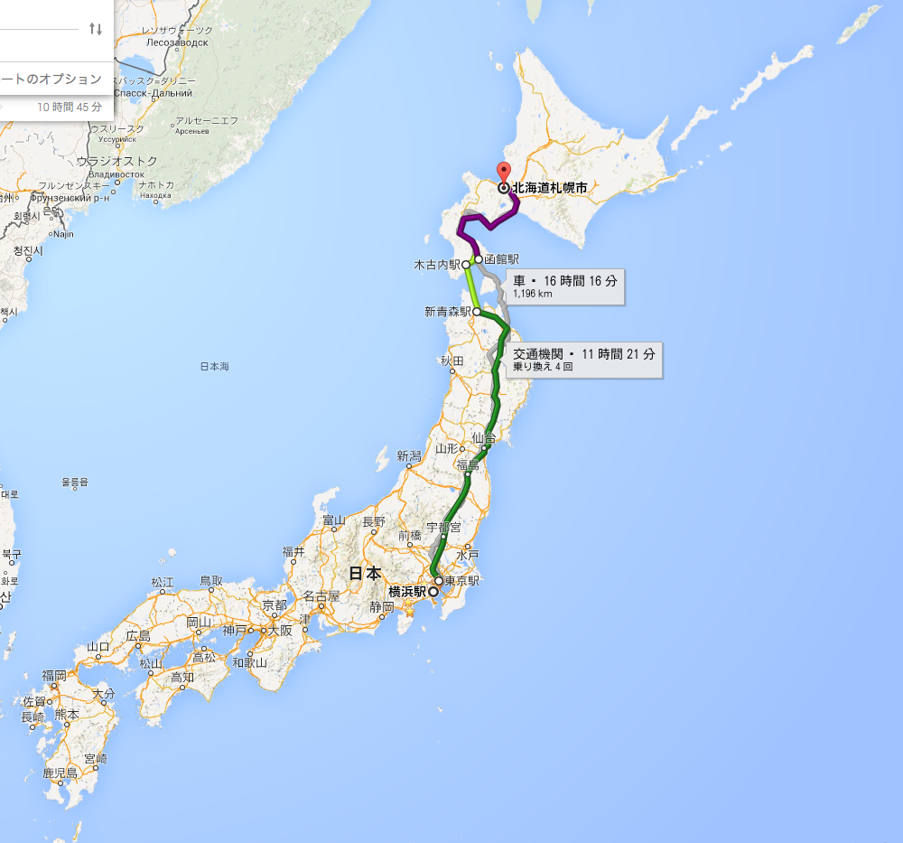

___

## 本題の前に...

> 今年書いたコードとか

___

### 主に...

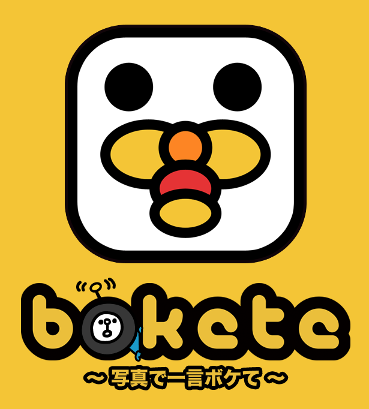

___

### 今年の実績

- ピーク時 **250-300req/1sec**
- iOS+Androidアプリ **280万インストール**
- **Yahoo! Japan**その他と連携
- 第17回**メディア芸術祭 審査委員会推薦作品**

___

### Bokete-Delta

- ボケての内部コード「**Bokete**」
- Alpha => Beta => Gamma => **Delta** <- 今ココ
- 今年でほぼ完成まで持ち込んだ
- 企業とのコラボ、スマホやアプリ対応 etc.

___

### Shodo

- 次期Boketeバージョンで使うために開発
- Rubyのautodocに触発される
- HTTP::Request / HTTP::Responseを食わせる
- ドキュメントをMarkdown出力
- JSON-RPCのAPIで利用
- `Shodo` / `Shodo::Suzuri` / `Shodo::Hanshi`

___

### use Shodo #01

    my $shodo = Shodo->new( document_root => 'sample_documents' );
    my $suzuri = $shodo->new_suzuri('get_entries');

    my $parameters = {
        method => 'get_entries',
        params => { category => 'technology', limit => 1 },
    };
    $suzuri->params(
        category => { isa => 'Str', documentation => '...' },
        limit => { isa => 'Int', default => 20, optional => 1, documentation => '...' }
    );
    ok $suzuri->validate($parameters->{params}); # Validate Parameter

    my $req = POST '/endpoint';
    $req->content(to_json($parameters));
    $suzuri->request($req); # Pass Request Object

___

### use Shodo #02

    my $res = HTTP::Response->new(200);
    $res->content(
        to_json(
            {
                result => {
                    entries => [ { title => 'Hello', body => 'This is an example.' } ]
                },
            }
        )
    );
    $suzuri->response($res); # Pass Response Object

    $shodo->stock($suzuri->doc());
    $shodo->write('test.md'); # Write the Markdown to file

___

### Markdown形式でドキュメント出力

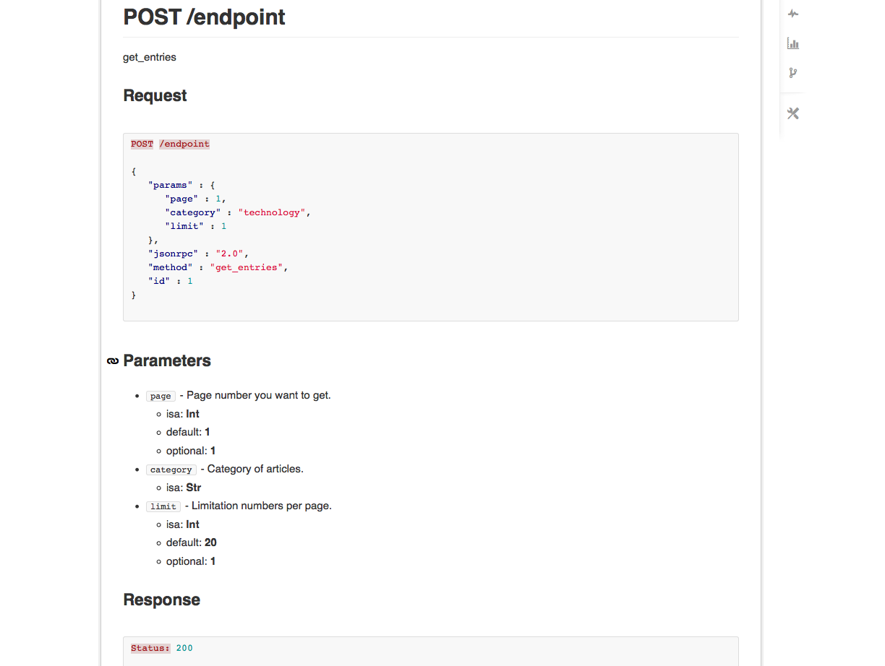

___

### 実際使っている

- JSON-RPCのAPIを試験するため
- `Test::Shodo::JSONRPC`
- リクエストパラメータをテストの中で記述
- モック内のレスポンスをそのままJSONで表示
- テストを走らせる => ドキュメント共有@GitHub
- 補足は*README.md*に書いておく

___

### 今年使い始めたモジュール

- Cinnamon
- Carton
- SQL::Maker
- Harriet
- JSON::RPC
- OAuth::Lite2
- AngularJS *(JS)*
- etc.

___

### 今年使い始めたサービス

- Amazon Web Services
  - EC2
  - ELB
  - RDS
  - ElastiCache
  - SES
- Travis-CI
- Uptimer

___

### 今年のプライベート

- **炎上**
- 一人暮らしをはじめる
- ラーメンを食い過ぎて太る
- 自炊にはまる
- 若干痩せる

___

### 12月23日(誕生日)

___

> ところで

___

### この地図なーんだぁ！

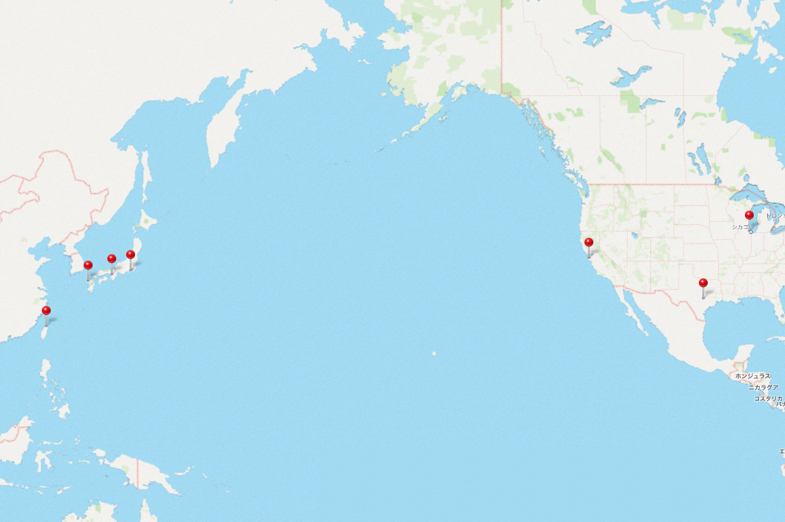

___

### 今年は色々なところへ行ったよぉ！

- 大阪 => Kansai.pm
- 台湾 => 視察
- アメリカ => YAPC::NA + サンフランシスコ見学
- 熱海 => 合宿 + 温泉 etc.
- 福岡 => Fukuoka.pm
- 五反田 => Perl入学式
- 渋谷 => PerlCasual / Shibuya.pl
- 八王子 => Hachioji.pm

___

### 賞もいただいたぉ！

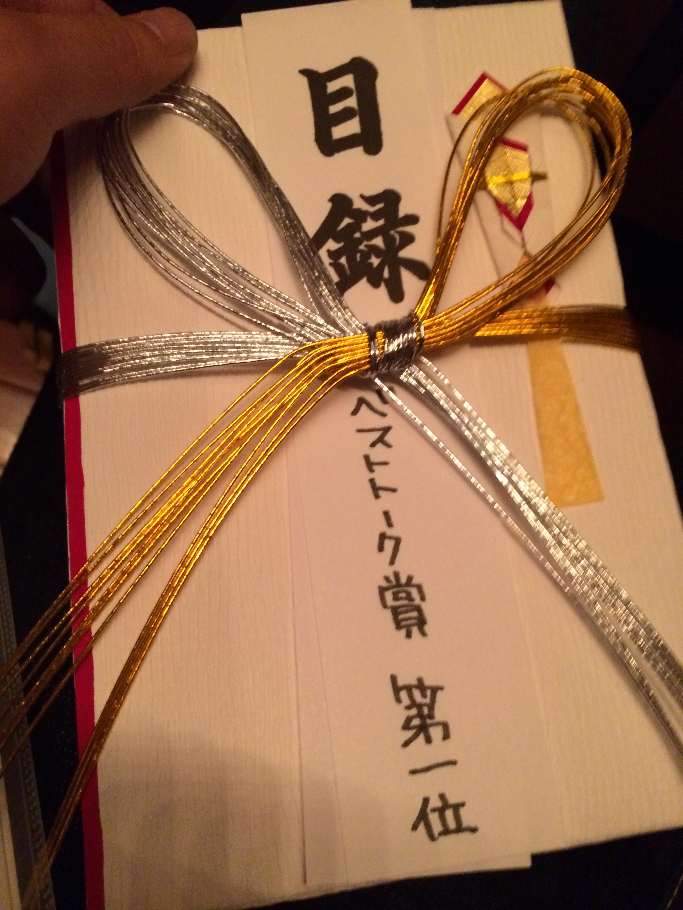

___

### JPA知事にも就任ぽよ！

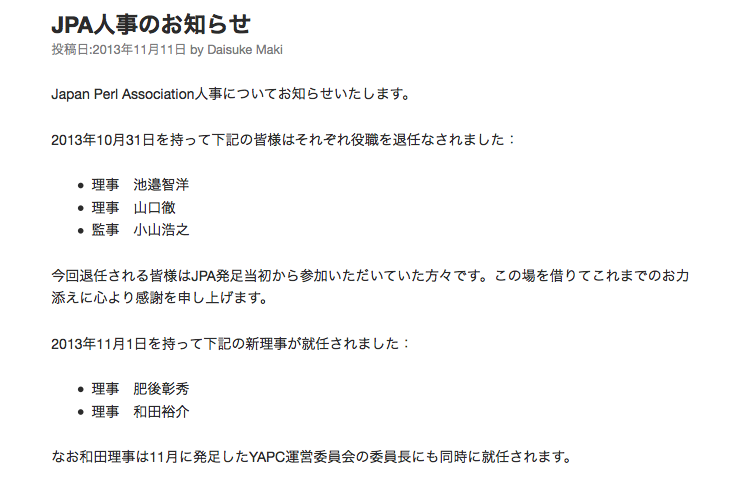

___

### まとめると...

- Boketeのコードたくさん書いて
- 色んなところに行って
- YAPCでベストトーク賞を取って
- JPAの理事になった！

___

## 結果...

___

### ベストトーク賞の副賞について

> JPAの中の人がJPAが出す 副賞で海外行くのおかしい...

僕は賞品無しで結果繰り上げ ＼(^o^)／

___

## それは置いといて...

___

海外を含めいろんなPerlコミュニティを見てきたので
その**個人的まとめ**と、JPA理事になったから今後やりたいことの**妄想話**をします

___

### Perlでよいなって思うところ

どこかな〜？

___

### その大きな一つはCPANとPAUSE

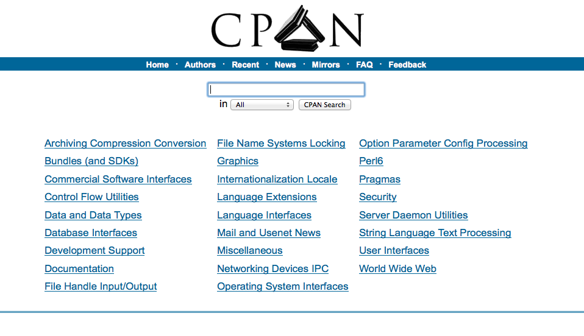

___

### CPANでよかったと思う点

- 集約されているからGitHub等を彷徨う必要がない
- 当然ながら`CPANシェル`や`cpanm`でサクッと入る
- ネームスペースが暗黙的に切られている
- `SYNOPSIS`が分かりいい
- CPAN Testersの存在

> そして... **顔写真が出る！**

___

search.cpan.org/**~miyagawa**/Plack-1.0030

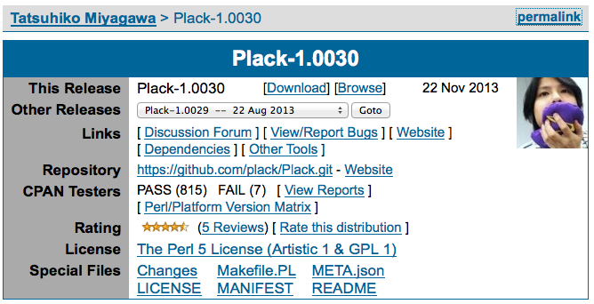

___

### 誰がつくってるか？が一目瞭然！

> そういえばBoketeでも...

___

### 使用モジュールの作者が身近

- Plack / Starman / Carton => *miyagawa*
- Mouse / Data::Validator / HTML::FillInForm::Lite => *gfuji*
- Router::Boom / FormValidator::Lite => *tokuhirom*
- DBIx::Skinny => *nekokak*
- Devel::KYTProf => *onishi*
- Test::mysqld / Server::Starter => *kazuho*
- Cinnamon => *shibazaki*

___

### 顔がわかると...

- キャラクターで判断出来る
- さらに日本人作者だと...
- 気楽に本人に質問出来る
- ドキュメントやBlog記事で使い方を把握出来る
- ユーザー同士で使い方を議論出来る

> ただし！日本国内の ドメスティックなコンテキストによる？

___

## YAPC::NA 2013

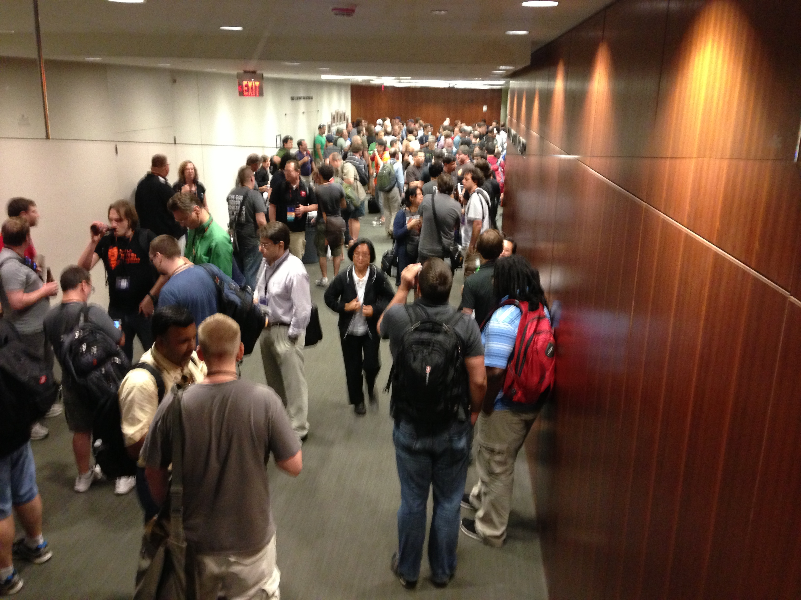

___

#### Inside Bokete:  Web Application with Mojolicious and others.

___

### 質問した

> Webアプリケーションはどうやって動かしている？

期待した答え => Starman / Starlet etc...

**返ってきた答え**

> nginx、Apache

___

> うっ...

___

### 当然だがコンテキストが異なる

- 英語が伝わってないだけかも知れないが...
- よく使っているモジュールを知らない人が多かった
- Web系のアプリを実践している人が少ない？
- `Catalyst`は根強い

> モジュールが輸出されるといいか？問題

___

### そういう経験が出来たからこそ！

> 海外カンファレンスに行くのは 非常に刺激を受けますね^^

- 特にYAPC::NAは参加しやすかった
- `Where are you from ?` で話しかけられる
- みんなが海外に行ける機会を増やせればいいのかにゃ...

___

## 話を国内に...

___

### Kansai.pm 第15回ミーティング

___

### 個性が出てた

- @shibu_yu36さんの**Cinnamon**
- @goccy54さんの**コピペ検出** など
- ライトな話からコアな話まで

> 「関西」だけにいろんな人がいるなー って印象

___

### ちなみに...大阪は

食い物が安い！さすが天下の台所

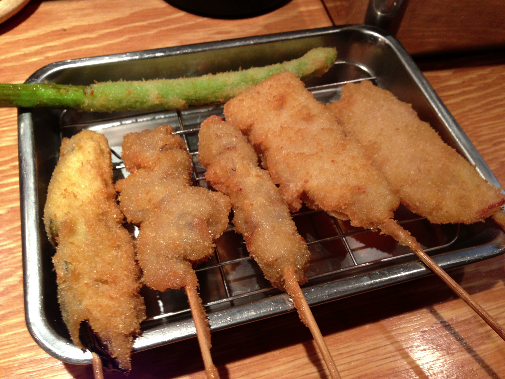

___

### Fukuoka.pm #24

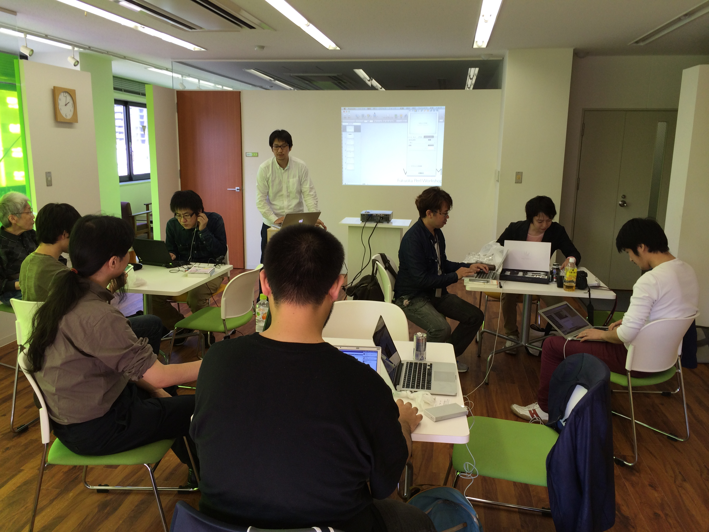

___

### 和気あいあいとしてた

- @h.satoshiさんの**クイズ○ービー**が面白かった
- 福岡の人の発表が少なかったのが残念？
- 屋台カルチャーなのかいろんな人と知り合った

> いい意味での仲間感がよかった

___

### ちなみに...福岡は

魚もうまーーーい！

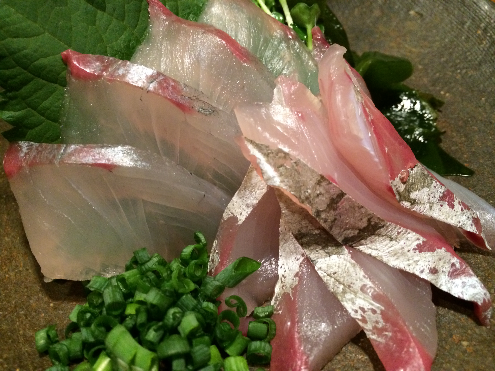

___

### PerlCasual #05 & Shibuya.pl #01

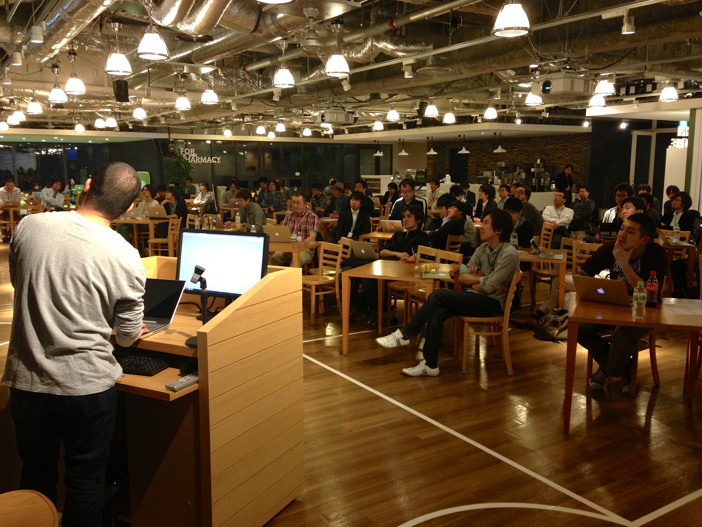

___

### 学びがある

- LINEさんのカフェ非常に良い
- [@koba04さんのサービスつくった話](http://koba04.com/slide/perl-casual-5/)
- [@fujiwaraさんのPlack/PSGIおさらい話](http://dl.dropboxusercontent.com/u/224433/plackcon/index.html)
- 個人的には@bayashiさんの小ネタがツボ
- こう言っちゃなんだけど**つぶぞろい感**すごい

___

### Perl入学式

___

### 新境地を感じる

> こんなPerlやりたい人いたのか！！

- 丁寧な教えとサポート
- テーブル毎に参加者が教え合っている
- ぶっちゃけビックリした

___

### ちなみに寿司が安くてウマい

___

### Hachioji.pm #34

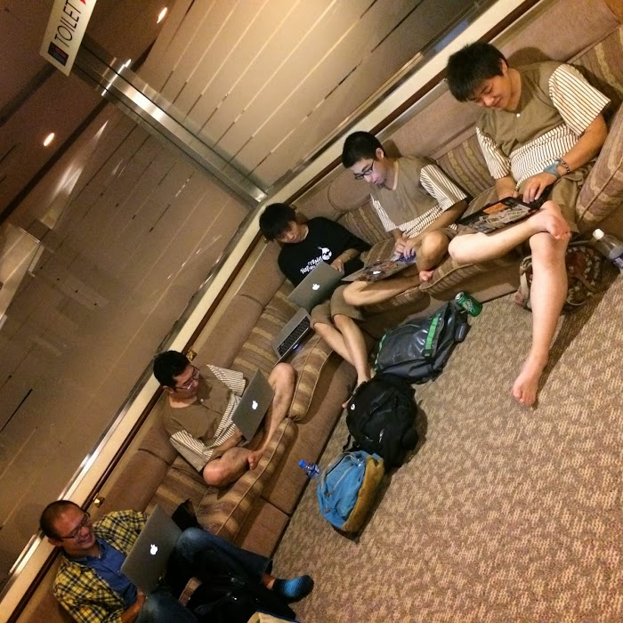

Photo by @uzulla

___

### 温泉いい！その1

- リラックスした状態でコード書くのよい
- ハッカソン形式なので自然と学びあえる
- タイ料理も美味かった

___

### ちなみに...八王子は

意外と近かった...

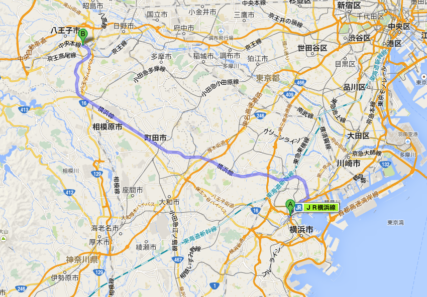

___

## 温泉といえば...

___

### 温泉発火村 #2

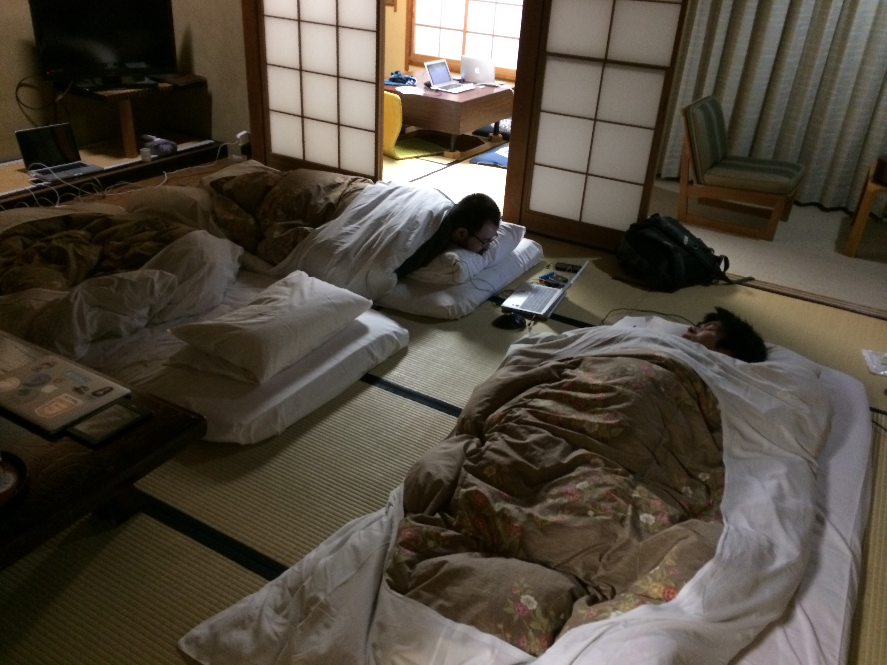

___

### 温泉いい！その2

- 進捗なかったけど得るものがあった
- @karupaneruraさんが主催
- 熱海の山木旅館さん
- 今まで話したことない人と技術話出来た

> Dropboxのキーバリューみたいな APIあるらしいよ

とか！

___

### ちなみに...熱海は

定食屋の飯がウマい

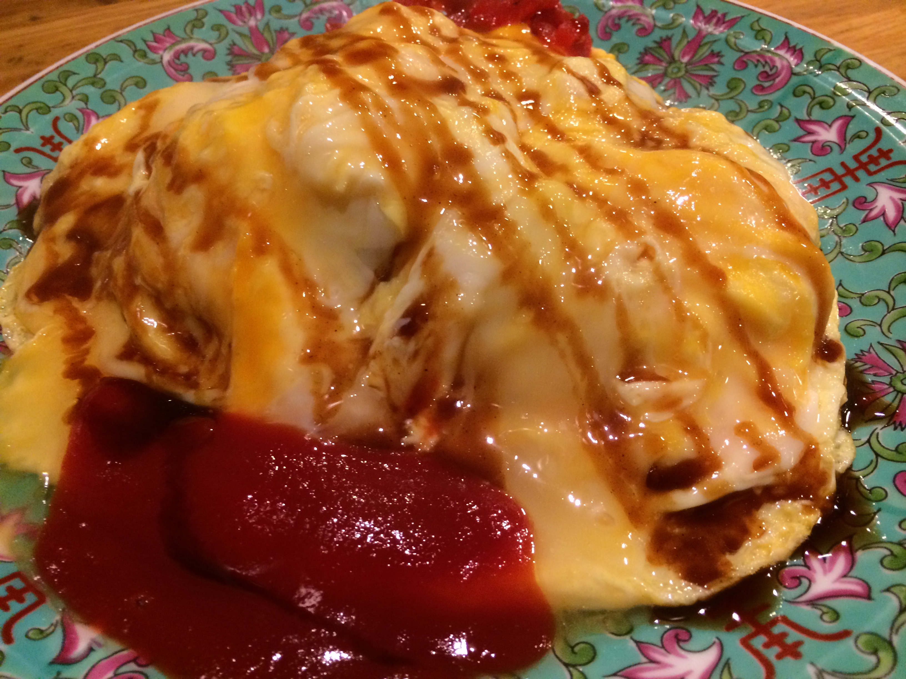

___

## ここで一旦まとめ

___

- **各々のPM毎に雰囲気が全然違う**
- **地元の人がどんどん表に出るといいかも**
- **温泉はだいぶブレークスルー感ある**

___

## たくらみ

___

> 地方活性はするんだけれどもそれ以前にいろんなところに行きたい！
> し、いろんなところに行くといいと思う！

___

## 温泉.pm !?

___

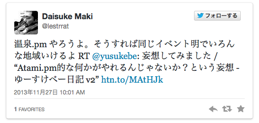

___

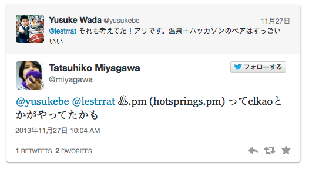

___

### 温泉.pmの妄想

- 参加者が旅館や料理屋についてBlogを書く
- その代わり優遇してもらう
- 宿ごとの施設などの情報が溜まっていく
- Win-Winじゃね？

___

### 現実的なやり方

- JPAとしてやるのは2015年度くらいから？
- と言っても責任の少ない軽い斡旋がいい
- 最初は有志でやっていこう
- 地方自治体や地元の観光協会に実績がわかるように
- ここだけの話「熱海」だと融通が効くかも

___

## そうすると...

> JPA的にいい感じの3本柱が立つ

___

- **YAPC::Asiaを含むイベント**
- **Perl入学式より派生する教育**
- **地方活性化と称して温泉.pm**

> あくまで現段階では個人的な妄想です^^

___

### 出来るか分からないけどアクティブにしていきます

___

## 最後のまとめ

___

### 2013年

- コードを書いてまだまだ学びたいと思いました
- いろんなところに行って楽しかったです
- 来年はYAPCを含め新しいチャレンジ頑張ります！

___

## おしまい

